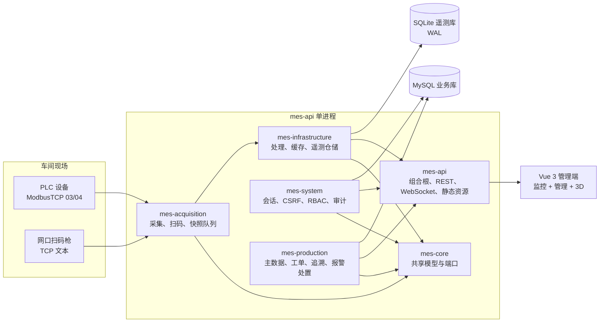
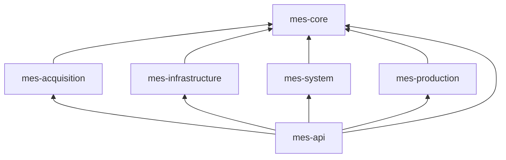
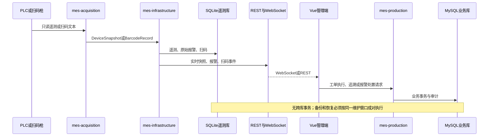
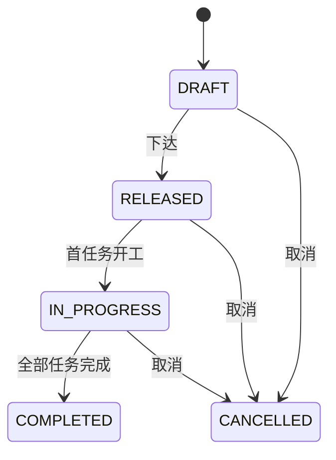
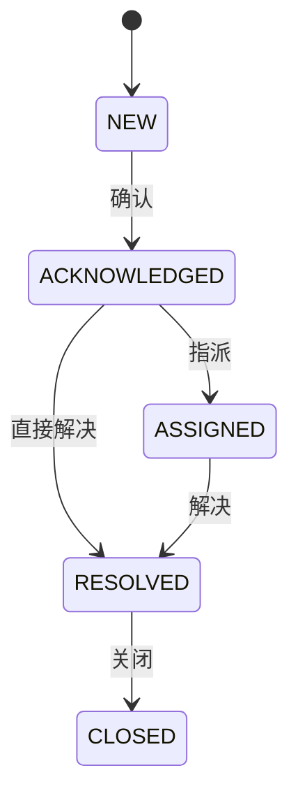
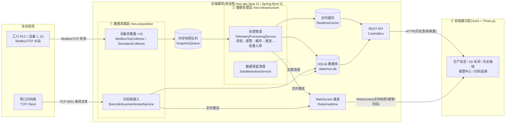
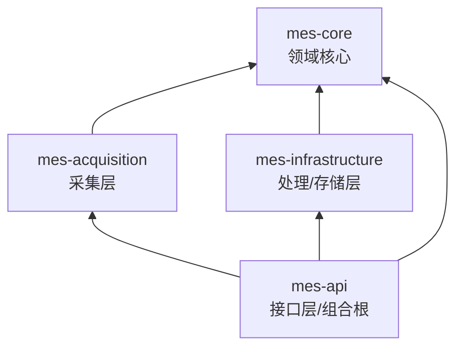
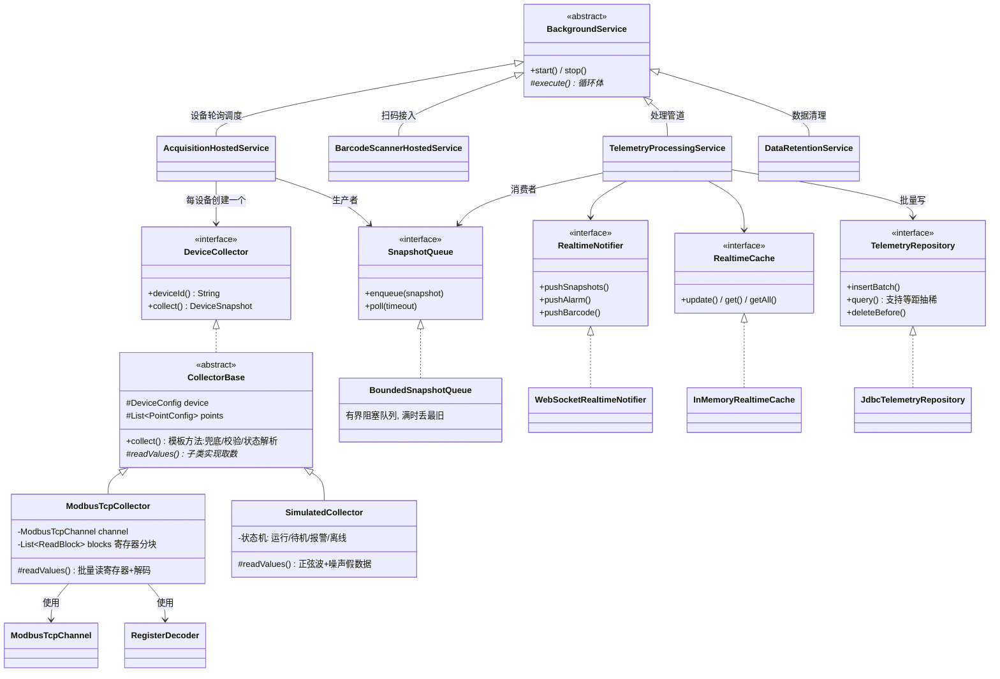
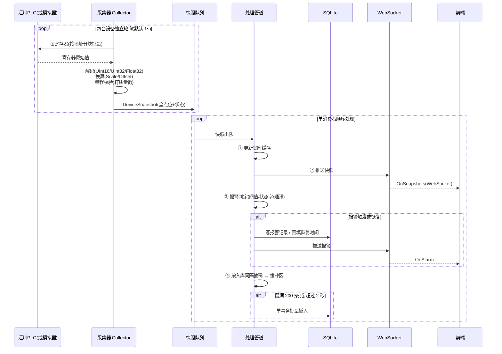
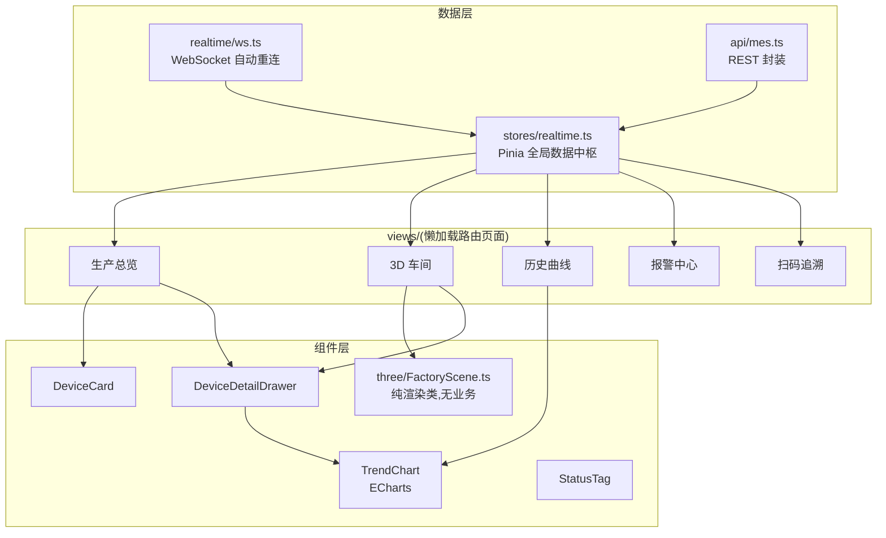

# MES 架构设计

本文描述仓库当前已实现的 Java 版架构。系统面向约 15 台 ModbusTCP 设备，采集侧只读 PLC，不包含设备写入、排产优化或跨库分布式事务。

## 1. 总体结构

后端是单个 `mes-api` Spring Boot 进程，由六个 Maven 模块组成；前端是 Vue 3 单页应用，生产监控与 Three.js 3D 车间继续保留，同时增加系统管理和生产管理页面。



## 2. 六模块职责与依赖



- `mes-core`：遥测实体、设备配置、后台服务基类，以及仓储、队列、实时通知和审计端口；不依赖 Spring Web 或数据库实现。
- `mes-acquisition`：ModbusTCP/模拟采集、寄存器解码、扫码枪 TCP 接入、有界队列；只依赖 core 和 Spring Context。
- `mes-infrastructure`：SQLite 数据源、建表、遥测/报警/扫码仓储、实时缓存、处理与保留任务；只依赖 core。
- `mes-system`：MySQL 系统域，包含认证、用户、角色、权限、菜单、审计、CSRF/CORS 与 Flyway。
- `mes-production`：MySQL 生产域，包含主数据、工单任务、生产追溯、报警处置及状态机。
- `mes-api`：唯一启动模块和组合根，装配其余五个模块，发布 REST、WebSocket、Swagger 和前端静态资源。

模块的公开边界和扩展约束分别记录在各模块的 `README.md`。

## 3. 双库边界

### 3.1 SQLite 遥测库

默认路径为 `data/mes.db`，连接 URL 可由 `MES_TELEMETRY_DB_URL` 覆盖。`MesSchemaInitializer` 建立遥测、报警、扫码表及索引，并启用 WAL。SQLite 保存：

- 设备点位历史 `TelemetryRecords`；
- 采集规则产生的原始报警 `AlarmRecords`；
- 网口扫码枪产生的原始扫码 `BarcodeRecords`。

遥测处理链路会更新内存实时缓存、通过 WebSocket 推送，并按批次写入 SQLite。保留任务只清理遥测侧超期数据。

### 3.2 MySQL 业务库

生产部署必须设置 `MES_BUSINESS_DB_ENABLED=true`。系统域与生产域使用同一具名业务数据源，但使用各自的 Flyway 位置和历史表：

- `flyway_schema_history_system`：用户、角色、权限、菜单、审计；
- `flyway_schema_history_production`：主数据、工单、任务、生产追溯、幂等记录、报警处置。

业务库不保存高频遥测。报警处置只以 `source_alarm_id` 引用 SQLite 原始报警 ID，当前实现不会在数据库层建立跨库外键或复制原始报警详情。

### 3.3 双库数据流



## 4. 安全模型

- 登录使用 Spring Security 服务端 Session；登录成功迁移 Session ID，每个账号最多一个并发 Session。
- 会话 Cookie 为 HttpOnly、SameSite=Strict；生产 TLS 下必须设置 `MES_SESSION_COOKIE_SECURE=true`。
- 修改请求使用 `XSRF-TOKEN` Cookie 和 `X-XSRF-TOKEN` Header 的 CSRF 校验。
- CORS 仅允许 `MES_ALLOWED_ORIGINS` 中的精确来源，并允许凭据；生产环境不可保留开发地址。
- 控制器通过权限码执行 RBAC，前端路由和菜单只负责可见性，服务端仍是授权权威。
- 密码使用 BCrypt cost 12。首次管理员由 `MES_BOOTSTRAP_ADMIN_PASSWORD` 在空库创建；该变量无默认值，也不会记录明文。
- 用户、角色、菜单、生产主数据、工单执行和报警处置等服务动作写入 MySQL 审计表；审计范围以当前应用服务实际调用为准，不宣称覆盖数据库外部变更。

## 5. 生产状态机

状态转换由领域代码校验，并用 `version` 乐观锁避免并发覆盖。



任务只允许 `READY -> IN_PROGRESS -> COMPLETED`。当前前端提供扫码开工、进行中报工和扫码完工；报工数量必须非负、合计大于零且累计不超过计划数。



报警处置记录在 MySQL；SQLite 原始报警的产生/恢复生命周期与处置状态是两个不同聚合。

## 6. 前端页面

前端路由当前包含：

- 监控：生产总览、3D 车间、历史曲线、SQLite 原始报警、实时扫码追溯；
- 系统管理：用户、角色、菜单、审计日志；
- 生产管理：生产主数据、生产工单及任务、生产追溯、报警处置；
- 认证辅助：登录和 403 页面。

菜单由内置监控菜单与 MySQL 动态菜单合并，再按权限码过滤。Three.js `FactoryScene` 仍负责 3D 渲染，设备状态来自实时 store；管理功能没有替换原有 3D/监控链路。

## 7. 运行与生命周期

采集器把快照写入有界队列；单消费者处理缓存、推送、报警和批量入库。Modbus 通讯失败会关闭连接，下次轮询重连，并生成离线快照；离线设备降低重试频率。WebSocket 客户端使用指数退避重连。

Spring Boot 配置为优雅停机。`BackgroundServiceRunner` 反向停止生产者，再停止消费者，使处理管道有机会刷新缓冲；这降低正常停机丢数风险，但不能替代数据库备份或断电保护。

部署、安全、备份与故障处置见 [部署与运维](部署与运维.md)。

<!-- 以下为历史版本存档，不参与当前架构说明。
# MES 生产监控系统 —— 架构设计说明(Java 版)

> 适用场景:15 台左右 ModbusTCP 设备(汇川 PLC 总线)的数据采集、存储与 3D 可视化监控。
> 只读采集(不写入设备),设备自身不存数。

---

## 1. 系统总体架构

系统按需求分为三层,层与层之间只通过**接口(Java interface)**与**网络协议(REST / WebSocket)**通信:



**关键设计决策:**

| 决策 | 理由 |
|---|---|
| 三层放在同一个进程(mes-api)托管 | 15 台设备的规模下单进程绰绰有余;部署只需拷一个目录,运维最简单。三层代码物理隔离在不同 Maven 模块里,将来要拆成独立采集服务时只需换宿主 |
| 采集层与处理层之间用有界内存队列解耦 | 写库慢不阻塞采集节拍;数据库短暂繁忙时数据在队列削峰,保证不丢数 |
| SQLite(WAL 模式)做存储 | 零安装、单文件、随目录迁移;WAL 模式读写不互锁且断电安全。要换 MySQL/PostgreSQL 只需改 mes-infrastructure 一个模块 |
| 用 Spring JDBC 而不是 JPA/Hibernate | 遥测是"批量写 + 时序查询"负载,SQL 需要精确可控(批量插入、窗口函数抽稀);ORM 的实体跟踪在这里只有开销没有收益 |
| 设备档案用 devices.json 而不入库 | 点表就是现场调试的产物,放配置文件便于版本管理、比对与整厂复制部署 |
| 模拟/真实采集用同一接口两个实现 | `Mode` 配置一键切换,前端与处理层完全无感知 |
| 自研 ModbusTCP 客户端(不引第三方库) | 只用到功能码 03/04 的读操作,报文结构固定;自己实现才能精确掌控超时、断线重连与字序约定,依赖也更少 |

---

## 2. 项目结构与分层依赖

```
MES-JAVA/
├── backend/                              # 后端(Java 21 / Spring Boot 3,Maven 多模块)
│   ├── pom.xml                           # 父 POM:统一版本与依赖管理
│   ├── mes-core/                         # 领域核心层:实体/枚举/接口/配置模型(只依赖 slf4j)
│   │   └── com/mes/core/
│   │       ├── entity/                   #   数据库实体:TelemetryRecord / AlarmRecord / BarcodeRecord
│   │       ├── enums/                    #   DeviceStatus / DataQuality / AlarmLevel / RegisterDataType
│   │       ├── model/                    #   内存模型:DeviceSnapshot / PointValue
│   │       ├── options/                  #   配置模型:AcquisitionOptions / DeviceConfig / PointConfig ...
│   │       ├── contract/                 #   层间契约:DeviceCollector / SnapshotQueue / *Repository ...
│   │       └── hosting/                  #   BackgroundService:长期后台任务基类
│   ├── mes-acquisition/                  # ① 数据采集层(依赖 core)
│   │   └── com/mes/acquisition/
│   │       ├── modbus/                   #   ModbusTcpChannel(连接自愈)/ RegisterDecoder(解码)
│   │       ├── collector/                #   CollectorBase / ModbusTcpCollector / SimulatedCollector
│   │       ├── pipeline/                 #   BoundedSnapshotQueue(有界队列)
│   │       └── hosting/                  #   AcquisitionHostedService(调度)/ BarcodeScannerHostedService
│   ├── mes-infrastructure/               # ② 数据处理 + 存储层(依赖 core)
│   │   └── com/mes/infrastructure/
│   │       ├── data/                     #   MesSchemaInitializer(建表建索引 + WAL)
│   │       ├── repository/               #   Telemetry / Alarm / Barcode 三个 JDBC 仓储
│   │       ├── caching/                  #   InMemoryRealtimeCache(实时值内存缓存)
│   │       └── processing/               #   TelemetryProcessingService(核心管道)/ DataRetentionService
│   └── mes-api/                          # 接口层 + 组合根(依赖上面三个模块)
│       └── com/mes/api/
│           ├── controller/               #   Device / Telemetry / Alarm / Barcode / System
│           ├── realtime/                 #   RealtimeWebSocketHandler / WebSocketRealtimeNotifier
│           ├── config/                   #   设备档案加载 / WebSocket / 静态资源 / 后台服务编排
│           └── resources/
│               ├── devices.json          #   ★ 设备点表配置(现场部署唯一要改的文件)
│               └── application.yml       #   存储策略 / 端口 / 数据源 / 日志
├── frontend/                             # ③ 前端展示层(Vue3 + TS + Vite)
│   └── src/
│       ├── api/                          #   REST 封装 + 与后端对应的 TS 类型
│       ├── realtime/                     #   WebSocket 客户端(自动重连)
│       ├── stores/                       #   Pinia 实时数据仓库(全前端唯一数据源)
│       ├── three/                        #   FactoryScene:Three.js 3D 车间(纯渲染,无业务)
│       ├── components/                   #   StatusTag / DeviceCard / TrendChart / DeviceDetailDrawer
│       ├── views/                        #   旧版业务页面(懒加载,模块化)
│       └── router/ utils/ styles/
├── deploy/                               # 部署:Dockerfile / docker-compose / 一键发布脚本
└── docs/                                 # 本文档
```

**分层依赖规则(编译期强制,由 Maven 模块依赖保证):**



- `mes-core` 不依赖任何模块,也不依赖数据库/Modbus/Web 等具体技术(POM 里只有 slf4j-api);
- 采集层与处理层**互不引用**,只通过 core 中的 `SnapshotQueue` 接口传递数据;
- 处理层推送前端时依赖 core 的 `RealtimeNotifier` 接口,WebSocket 实现放在 api 层 —— 因此 mes-infrastructure 不依赖 Web 框架;
- 只有 `mes-api`(组合根)知道所有实现并负责依赖注入装配。

---

## 3. 核心类型继承/实现关系



### 3.1 后台服务的生命周期

.NET 的 `BackgroundService` 在 Java 侧由 `com.mes.core.hosting.BackgroundService` 复刻:
子类只实现 `execute()` 循环体,基类负责线程创建、中断协作与超时等待。
`mes-api` 的 `BackgroundServiceRunner`(Spring `SmartLifecycle`)按 `@Order` 编排启停:

```
启动:TelemetryProcessingService(10) → DataRetentionService(20)
     → AcquisitionHostedService(30) → BarcodeScannerHostedService(40)
停机:反序 —— 先停生产者(扫码、采集),最后停消费者(处理管道)
```

停机顺序是刻意设计的:**生产者先停、消费者后停**,处理管道才能把队列里剩余的快照和缓冲区里未落库的遥测全部写完再退出,
配合 `server.shutdown: graceful` 做到停机不丢数据。

---

## 4. 数据流与处理逻辑

### 4.1 遥测数据主链路(每台设备每秒一拍)



采集侧用固定大小线程池并发轮询(每台设备一个任务),互不影响:
一台设备通讯超时不会拖慢其它设备的采集节拍。

### 4.2 通讯失败时的行为(数据稳定性设计)

1. `ModbusTcpChannel` 抛出异常 → 连接被关闭,下次读取自动重连;
2. `CollectorBase.collect()` 捕获一切异常 → 返回 `online=false` 的离线快照,**轮询循环永不中断**;
3. 调度器发现离线 → 自动降频为重连间隔(默认 5s)重试,避免重连风暴;
4. 处理管道收到离线快照 → 生成"通讯断开"报警(去重,只报一次),恢复后自动回填恢复时间;
5. 离线期间不产生伪造数据入库,数据缺口在历史曲线上如实呈现。

### 4.3 数据正确性保障清单

| 环节 | 措施 |
|---|---|
| 采集 | 按数据类型严格解码(32 位默认高字在前);Scale/Offset 换算集中在 `CollectorBase` 一处 |
| 校验 | 每点位可配量程 RangeMin/Max,越界打 `Uncertain` 质量戳,随数据入库可追溯 |
| 缓冲 | 有界队列(10000 帧)+ 满时丢最旧策略 + 丢帧计数(`/api/system/info` 可观测),内存永不爆 |
| 入库 | JDBC 批量插入单事务提交;停机时缓冲区强制落库;SQLite WAL 模式断电安全 |
| 时间 | 数据库统一存 UTC 毫秒时间戳(INTEGER),排序精确、索引高效、无时区歧义;出口序列化为 ISO-8601 |
| 报警 | 激活态去重(持续越限只报一条)+ 滞回死区(默认阈值 2%,防止临界值抖动刷屏),触发/恢复完整生命周期 |
| 容量 | 入库按 `StorageIntervalSeconds` 抽稀 + 超期数据每日自动清理 |

### 4.4 扫码数据链路

```
扫码枪(TCP Client) ──条码文本──▶ TCP 监听 6001 ──按行解析──▶
按来源 IP 映射工位(ScannerBindings) ──▶ 入库 BarcodeRecords ──▶ WebSocket 推送前端
```

### 4.5 实时通道协议

替代 .NET 版 SignalR 的是原生 WebSocket(`/hubs/realtime`),消息为统一信封的 JSON,单向下行:

```json
{ "event": "OnSnapshots", "data": [ /* DeviceSnapshot[] */ ] }
{ "event": "OnAlarm",     "data": { /* AlarmRecord */ } }
{ "event": "OnBarcode",   "data": { /* BarcodeRecord */ } }
```

事件名沿用 .NET + SignalR 版本的命名,前端代码不必区分后端是哪一版实现。

前端 `realtime/ws.ts` 按 `event` 分发到 Pinia store;断线后指数退避自动重连(1s 起,上限 30s)。
选原生 WebSocket 而不是 STOMP:只有三种下行事件、没有订阅关系,信封模式的代码量最小且前端零依赖。

---

## 5. 前端架构



**约定:**
- 组件不直接调用 API/WebSocket,一律经过 `stores/realtime.ts`,数据流向单一,便于调试;
- `FactoryScene` 是纯 Three.js 渲染类:布局来自后端设备档案(`Position` 字段),状态由外部灌入,点击通过回调抛出 —— 换 3D 模型或调整布局都不影响业务代码;
- 新增业务模块 = `views/` 加一个页面 + `router/index.ts` 加一条路由,其余零改动。

---

## 6. 数据库表结构

| 表 | 用途 | 关键索引 |
|---|---|---|
| `TelemetryRecords` | 遥测历史(窄表:设备+点位+值+质量+时间) | (DeviceId, PointName, Timestamp)、(Timestamp) |
| `AlarmRecords` | 报警生命周期(触发时间 + 恢复时间) | (TriggeredAt)、(ResolvedAt) |
| `BarcodeRecords` | 扫码追溯 | (Barcode)、(ScannedAt) |

时间列存 UTC 毫秒(INTEGER)。手工查库时用
`datetime(Timestamp/1000, 'unixepoch', 'localtime')` 转成可读时间。

历史曲线查询在 SQL 里用窗口函数等距抽稀(`ROW_NUMBER()` 取模),
无论时间跨度多大,返回给前端的点数都不超过 `maxPoints`,浏览器不会被几十万个点拖死。

容量估算:15 台 × 约 5 点位 × 每 5s 入库一条 ≈ **130 万行/月**;
按 90 天保留期约 400 万行,SQLite 配合上述索引完全可承受(此量级查询毫秒级)。
若将来采集规模扩大 10 倍,建议把 mes-infrastructure 的存储实现换成 TimescaleDB/InfluxDB,其余层不需要改动。

---

## 7. 切换到真实 PLC 的步骤

1. 打开 `backend/mes-api/src/main/resources/devices.json`(生产环境改 jar 同级的 `devices.json`);
2. `Acquisition.Mode` 改为 `"Modbus"`;
3. 按现场实际填写每台设备的 `IpAddress` / `Port` / `UnitId`;
4. 按 PLC 点表核对/修改 `PointTemplates` 中的寄存器地址、数据类型、Scale;
5. 扫码枪:把 `Scanner.ScannerBindings` 的 key 换成各扫码枪的实际 IP,并把扫码枪配置为 TCP Client 模式连接 `服务器IP:6001`;
6. 重启服务,无需改任何代码。

> 汇川 PLC 注意事项:AM/H5U 系列默认 ModbusTCP 端口 502、从站号 1;
> 32 位数据默认高字在前(本系统的解码约定),如现场设置为低字在前,调整 `RegisterDecoder` 即可。

---

## 8. 与 .NET 原版的技术映射

同一套架构、同一套配置文件格式,仅平台组件替换,便于两版对照维护:

| 关注点 | .NET 8 版 | Java 版 |
|---|---|---|
| 运行框架 | ASP.NET Core | Spring Boot 3 |
| 模块划分 | 旧版 csproj | 旧版 Maven 模块 |
| 依赖注入 | 内置 DI 容器 | Spring IoC |
| 后台任务 | `BackgroundService` | 自研 `BackgroundService` + `SmartLifecycle` 编排 |
| 采集并发 | `Task` + `Channel` | 固定线程池 + `LinkedBlockingDeque` |
| Modbus | NModbus | 自研 `ModbusTcpChannel`(功能码 03/04) |
| 数据访问 | EF Core | Spring JDBC(`JdbcTemplate`) |
| 实时推送 | SignalR | 原生 WebSocket + JSON 信封 |
| 配置绑定 | `IOptions` + appsettings | `@ConfigurationProperties` + Jackson 读 devices.json |
| 接口文档 | Swashbuckle | springdoc-openapi |
| 打包交付 | 自包含 exe | 可执行 fat jar(`java -jar`) |
-->
